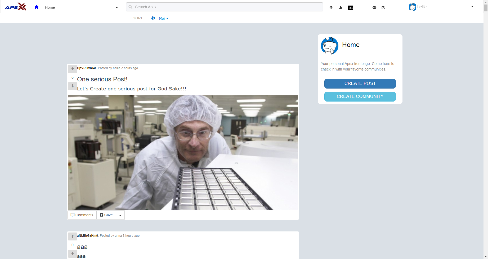

# ApeX Frontend

### Note: Apex is no longer maintained or deployed!
[](https://travis-ci.com/DarkGeekMS/ApeX-Web)

## Brief Description

Front-End code of ApeX, a social media application that mimics reddit.


## Utilized Technologies 

1) VueJS (A JavaScript Framework).
2) Bootstrap (A CSS Framework).
3) Axios (For REST Requests).
4) Mocha (For SFCs Unit Test).


## Installation Guide

1) Setup:
```
npm install
```
2) Serve for Development:
```
npm run serve
```
3) Compile for Production:
```
npm run build
```


## Website Samples





